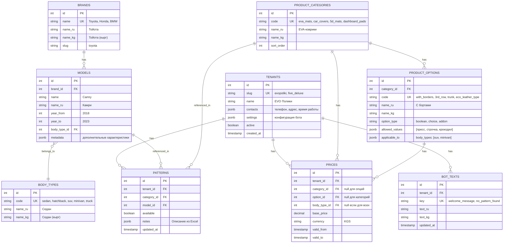

# Архитектура базы данных - SaaS платформа для чат-ботов авто-аксессуаров

## 1. ОБОСНОВАНИЕ ВЫБОРА СУБД И ORM

### Выбор СУБД: PostgreSQL

**Рекомендация:** PostgreSQL 15+

**Обоснование:**

1. **Надежность и ACID-совместимость**
   - Полная поддержка транзакций критична для работы с заказами и ценами
   - Гарантия целостности данных при конкурентных запросах от нескольких клиентов

2. **Масштабируемость для мульти-арендности**
   - Эффективная работа с индексами для фильтрации по tenant_id
   - Поддержка partitioning для разделения данных по клиентам в будущем
   - Возможность горизонтального масштабирования при росте количества арендаторов

3. **Богатые типы данных**
   - JSONB для хранения метаданных и конфигурации (тексты бота, переводы)
   - Array types для списков опций
   - Full-text search для поиска по моделям авто с учетом опечаток

4. **Поддержка сложных запросов**
   - Подзапросы и CTE для проверки наличия лекал
   - Window functions для аналитики продаж
   - Foreign keys и constraints для поддержания целостности

5. **Производственная готовность**
   - Отличная производительность на чтение (критично для бота)
   - Бесплатная, с активным community
   - Простое резервное копирование и репликация

**Альтернативы:**
- ❌ SQLite: Не подходит для продакшена с множественными подключениями
- ❌ MySQL: Менее строгие ограничения целостности, слабее поддержка JSON
- ⚠️ MongoDB: Избыточна для структурированных данных, сложнее поддерживать связи

---

### Выбор ORM: SQLAlchemy 2.0+

**Рекомендация:** SQLAlchemy 2.0 с async support

**Обоснование:**

1. **Гибкость и мощь**
   - Поддержка как декларативного стиля, так и Core API
   - Возможность писать сложные запросы без raw SQL
   - Полный контроль над производительностью

2. **Асинхронность**
   - SQLAlchemy 2.0 имеет нативную поддержку async/await
   - Критично для обработки множественных запросов от бота
   - Интеграция с asyncio для WhatsApp/Instagram API

3. **Миграции через Alembic**
   - Автогенерация миграций из моделей
   - Версионирование схемы БД
   - Откат изменений (rollback)

4. **Типизация**
   - Отличная поддержка type hints
   - Интеграция с mypy для статической проверки типов
   - Автодополнение в IDE

5. **Независимость от фреймворка**
   - Работает standalone или с FastAPI/Flask
   - Не привязывает к конкретному веб-фреймворку

**Альтернативы:**
- ❌ Django ORM: Привязка к Django фреймворку, избыточность для нашего кейса
- ⚠️ Tortoise ORM: Молодой проект, меньше community, но хороший async ORM
- ⚠️ Peewee: Простой, но менее мощный для сложных запросов

---

## 2. СХЕМА БАЗЫ ДАННЫХ

### Принципы проектирования:

1. **Row-Level Multitenancy** - каждая таблица с данными имеет `tenant_id`
2. **Нормализация** - исключение дублирования, использование справочников
3. **Гибкое ценообразование** - цены привязаны к tenant_id
4. **Расширяемость** - структура позволяет добавлять новые продукты и опции

---

### Диаграмма сущностей (ER-диаграмма)



---

### Таблицы детально

#### 1. **tenants** - Клиенты (арендаторы)
```sql
CREATE TABLE tenants (
    id SERIAL PRIMARY KEY,
    slug VARCHAR(50) UNIQUE NOT NULL,  -- evopoliki, five_deluxe
    name VARCHAR(255) NOT NULL,        -- "EVO Полики", "Five Deluxe"
    contacts JSONB,                    -- {"phone": "+996...", "address": "...", "hours": "..."}
    settings JSONB,                    -- конфигурация бота
    active BOOLEAN DEFAULT TRUE,
    created_at TIMESTAMP DEFAULT NOW(),
    updated_at TIMESTAMP DEFAULT NOW()
);

CREATE INDEX idx_tenants_slug ON tenants(slug);
```

#### 2. **brands** - Марки автомобилей
```sql
CREATE TABLE brands (
    id SERIAL PRIMARY KEY,
    name VARCHAR(100) UNIQUE NOT NULL,  -- Toyota
    name_ru VARCHAR(100),               -- Тойота
    name_kg VARCHAR(100),               -- Тойота
    slug VARCHAR(100) UNIQUE,
    created_at TIMESTAMP DEFAULT NOW()
);

CREATE INDEX idx_brands_slug ON brands(slug);
CREATE INDEX idx_brands_name_trgm ON brands USING gin(name gin_trgm_ops);  -- для fuzzy search
```

#### 3. **body_types** - Типы кузова
```sql
CREATE TABLE body_types (
    id SERIAL PRIMARY KEY,
    code VARCHAR(50) UNIQUE NOT NULL,  -- sedan, suv, minivan
    name_ru VARCHAR(100) NOT NULL,
    name_kg VARCHAR(100),
    sort_order INTEGER DEFAULT 0
);
```

#### 4. **models** - Модели автомобилей
```sql
CREATE TABLE models (
    id SERIAL PRIMARY KEY,
    brand_id INTEGER NOT NULL REFERENCES brands(id) ON DELETE CASCADE,
    name VARCHAR(100) NOT NULL,
    name_ru VARCHAR(100),
    year_from INTEGER,
    year_to INTEGER,
    body_type_id INTEGER REFERENCES body_types(id),
    metadata JSONB,  -- {"steering": "left", "generation": "XV70"}
    created_at TIMESTAMP DEFAULT NOW(),
    UNIQUE(brand_id, name, year_from, year_to)
);

CREATE INDEX idx_models_brand ON models(brand_id);
CREATE INDEX idx_models_body_type ON models(body_type_id);
CREATE INDEX idx_models_name_trgm ON models USING gin(name gin_trgm_ops);
```

#### 5. **product_categories** - Категории товаров
```sql
CREATE TABLE product_categories (
    id SERIAL PRIMARY KEY,
    code VARCHAR(50) UNIQUE NOT NULL,  -- eva_mats, car_covers, 5d_mats
    name_ru VARCHAR(255) NOT NULL,
    name_kg VARCHAR(255),
    description_ru TEXT,
    description_kg TEXT,
    sort_order INTEGER DEFAULT 0,
    active BOOLEAN DEFAULT TRUE
);
```

#### 6. **product_options** - Опции товаров
```sql
CREATE TABLE product_options (
    id SERIAL PRIMARY KEY,
    category_id INTEGER NOT NULL REFERENCES product_categories(id) ON DELETE CASCADE,
    code VARCHAR(50) NOT NULL,         -- with_borders, 3rd_row
    name_ru VARCHAR(255) NOT NULL,
    name_kg VARCHAR(255),
    option_type VARCHAR(20) NOT NULL,  -- boolean, choice, addon
    allowed_values JSONB,              -- для choice: ["пресс", "строчка", "крокодил"]
    applicable_to JSONB,               -- {"body_types": ["suv", "minivan"]}
    sort_order INTEGER DEFAULT 0,
    UNIQUE(category_id, code)
);

CREATE INDEX idx_options_category ON product_options(category_id);
```

#### 7. **patterns** - Лекала (наличие выкроек)
```sql
CREATE TABLE patterns (
    id SERIAL PRIMARY KEY,
    tenant_id INTEGER NOT NULL REFERENCES tenants(id) ON DELETE CASCADE,
    category_id INTEGER NOT NULL REFERENCES product_categories(id) ON DELETE CASCADE,
    model_id INTEGER NOT NULL REFERENCES models(id) ON DELETE CASCADE,
    available BOOLEAN DEFAULT TRUE,
    notes TEXT,                        -- из колонки "Описание" в Excel
    created_at TIMESTAMP DEFAULT NOW(),
    updated_at TIMESTAMP DEFAULT NOW(),
    UNIQUE(tenant_id, category_id, model_id)
);

CREATE INDEX idx_patterns_tenant ON patterns(tenant_id);
CREATE INDEX idx_patterns_model ON patterns(model_id);
CREATE INDEX idx_patterns_lookup ON patterns(tenant_id, category_id, model_id);
```

#### 8. **prices** - Цены
```sql
CREATE TABLE prices (
    id SERIAL PRIMARY KEY,
    tenant_id INTEGER NOT NULL REFERENCES tenants(id) ON DELETE CASCADE,
    category_id INTEGER REFERENCES product_categories(id) ON DELETE CASCADE,
    option_id INTEGER REFERENCES product_options(id) ON DELETE CASCADE,
    body_type_id INTEGER REFERENCES body_types(id) ON DELETE CASCADE,
    base_price DECIMAL(10, 2) NOT NULL,
    currency VARCHAR(3) DEFAULT 'KGS',
    valid_from TIMESTAMP DEFAULT NOW(),
    valid_to TIMESTAMP,
    created_at TIMESTAMP DEFAULT NOW(),
    CHECK (category_id IS NOT NULL OR option_id IS NOT NULL),
    CHECK (NOT (category_id IS NOT NULL AND option_id IS NOT NULL))
);

CREATE INDEX idx_prices_tenant ON prices(tenant_id);
CREATE INDEX idx_prices_category ON prices(category_id);
CREATE INDEX idx_prices_option ON prices(option_id);
CREATE INDEX idx_prices_validity ON prices(valid_from, valid_to) WHERE valid_to IS NULL;
```

#### 9. **bot_texts** - Тексты бота
```sql
CREATE TABLE bot_texts (
    id SERIAL PRIMARY KEY,
    tenant_id INTEGER NOT NULL REFERENCES tenants(id) ON DELETE CASCADE,
    key VARCHAR(100) NOT NULL,         -- welcome_message, no_pattern_found
    text_ru TEXT NOT NULL,
    text_kg TEXT,
    updated_at TIMESTAMP DEFAULT NOW(),
    UNIQUE(tenant_id, key)
);

CREATE INDEX idx_bot_texts_tenant ON bot_texts(tenant_id);
```

---

## 3. ПРИМЕРЫ ЗАПРОСОВ

### Проверка наличия лекал для модели
```sql
SELECT p.available, p.notes
FROM patterns p
JOIN models m ON p.model_id = m.id
JOIN brands b ON m.brand_id = b.id
WHERE p.tenant_id = 1
  AND p.category_id = 1  -- EVA-коврики
  AND b.slug = 'toyota'
  AND LOWER(m.name) = 'camry'
  AND (m.year_from <= 2020 AND (m.year_to IS NULL OR m.year_to >= 2020));
```

### Получение цены для конфигурации
```sql
-- Базовая цена EVA-ковриков для седана
SELECT base_price
FROM prices
WHERE tenant_id = 1
  AND category_id = 1
  AND body_type_id = (SELECT id FROM body_types WHERE code = 'sedan')
  AND (valid_to IS NULL OR valid_to > NOW());

-- Цена опции "с бортами"
SELECT base_price
FROM prices
WHERE tenant_id = 1
  AND option_id = (SELECT id FROM product_options WHERE code = 'with_borders')
  AND (valid_to IS NULL OR valid_to > NOW());
```

---

## 4. ИНДЕКСЫ И ОПТИМИЗАЦИЯ

### Рекомендуемые индексы для производительности:

```sql
-- Для полнотекстового поиска по моделям
CREATE EXTENSION IF NOT EXISTS pg_trgm;
CREATE INDEX idx_models_name_trgm ON models USING gin(name gin_trgm_ops);
CREATE INDEX idx_brands_name_trgm ON brands USING gin(name gin_trgm_ops);

-- Композитные индексы для частых запросов
CREATE INDEX idx_patterns_lookup ON patterns(tenant_id, category_id, model_id);
CREATE INDEX idx_prices_active ON prices(tenant_id, category_id, body_type_id)
    WHERE valid_to IS NULL;

-- Partial индексы для активных сущностей
CREATE INDEX idx_tenants_active ON tenants(id) WHERE active = TRUE;
CREATE INDEX idx_categories_active ON product_categories(id) WHERE active = TRUE;
```

---

## 5. БЕЗОПАСНОСТЬ И ИЗОЛЯЦИЯ ДАННЫХ

### Row-Level Security (RLS) для полной изоляции

```sql
-- Включить RLS для критичных таблиц
ALTER TABLE patterns ENABLE ROW LEVEL SECURITY;
ALTER TABLE prices ENABLE ROW LEVEL SECURITY;
ALTER TABLE bot_texts ENABLE ROW LEVEL SECURITY;

-- Политика: пользователь видит только данные своего tenant
CREATE POLICY tenant_isolation ON patterns
    FOR ALL
    USING (tenant_id = current_setting('app.current_tenant_id')::INTEGER);

CREATE POLICY tenant_isolation ON prices
    FOR ALL
    USING (tenant_id = current_setting('app.current_tenant_id')::INTEGER);
```

---

## 6. МИГРАЦИЯ И ВЕРСИОНИРОВАНИЕ

Используется **Alembic** для управления схемой БД.

Структура:
```
database/
├── alembic/
│   ├── versions/
│   │   └── 001_initial_schema.py
│   ├── env.py
│   └── script.py.mako
├── alembic.ini
└── models.py
```

---

## 7. РАСШИРЕНИЯ POSTGRESQL

```sql
CREATE EXTENSION IF NOT EXISTS pg_trgm;      -- Fuzzy search
CREATE EXTENSION IF NOT EXISTS btree_gin;    -- Composite indexes
CREATE EXTENSION IF NOT EXISTS "uuid-ossp";  -- UUID generation (опционально)
```
